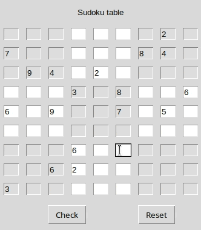
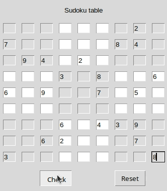

# Sudoku solver

Graficzny program do rozwiązywania gry logicznej sudoku.

## Demo



## Użycie
```bash
git clone https://github.com/Bartmannn/sudoku-solver.git
cd sudoku-solver
python3 main.py
```

## Środowisko testowe
- Python 3.12.3
- Linux Ubuntu 24.04.2 LTS
